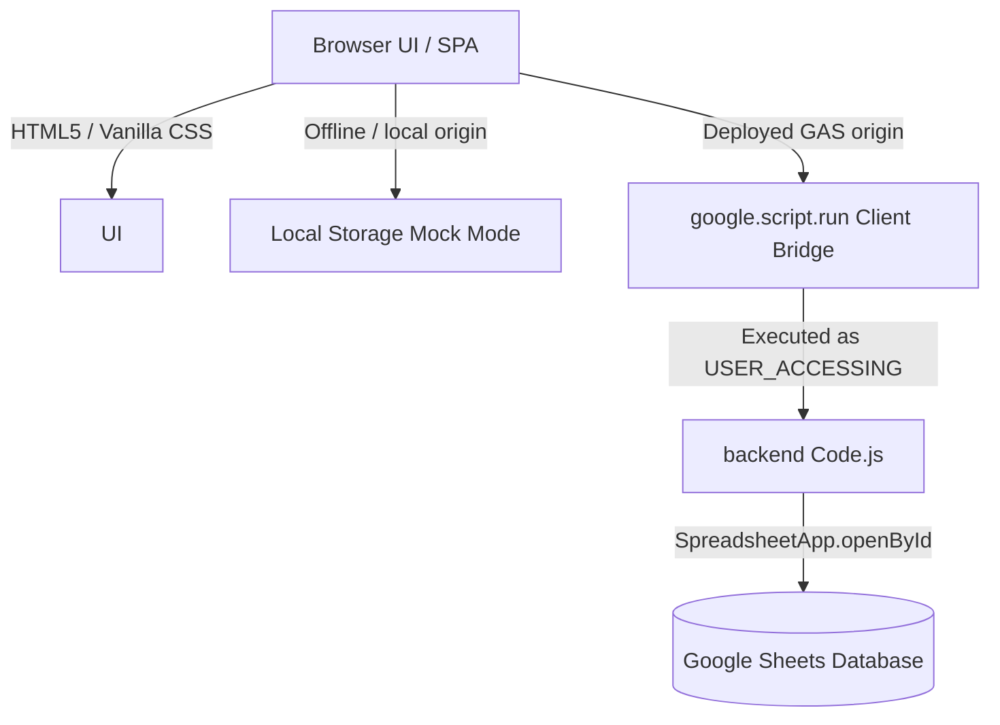

# 🤖 AI Agent & Gemini Development Guide (GEMINI.md)

Welcome, AI Agent! This document outlines the architectural patterns, security policies, data schemas, and development constraints of the **DivvPay** codebase. Use this file as a source of truth when modifying, refactoring, or extending this application.

---

## 🏛️ Architecture Overview

DivvPay is a decoupled, single-page application (SPA) optimized for standard Google Apps Script (GAS) deployment as a standalone Web App.



### 1. The Dynamic Context Rule
All server-side APIs inside [Code.js](file:///Users/kentaktwo/projects/katk3n/divvpay/src/Code.js) must remain **stateless** and protocol-agnostic. 
- Do **not** hardcode sheet URLs or IDs.
- Every API endpoint that touches data must accept `spreadsheetId` as its first parameter.
- The client-side state maintains the current active `SPREADSHEET_ID` and feeds it back into every server call.

### 2. Deployment Constraints & Compilation
Google Apps Script sandboxes the frontend inside a `googleusercontent.com` `<iframe>`. Because of this:
- Standard multi-file HTML loads are slow and complex.
- Frontend files (`src/stylesheet.html` and `src/javascript.html`) **must be inlined** into `dist/index.html` via the compiler script [build.js](file:///Users/kentaktwo/projects/katk3n/divvpay/build.js).
- **NEVER** edit `dist/index.html` directly. Always make changes in `src/` and run `node build.js` to re-compile.

---

## 📊 Database Schema (Google Sheets)

The initialized spreadsheet contains four core sheets. Ensure any backend changes respect this structure:

### 1. `members`
Stores the group's dynamic list of members.
| Column | Type | Description |
|---|---|---|
| `name` | String | Unique display name (Key for cost mapping) |
| `email` | String | Optional Google email for automatic active user detection |
| `color` | String (Hex) | Theme color for charts, badges, and progress tracks |

### 2. `categories`
Categorization and basic split burden rules.
| Column | Type | Description |
|---|---|---|
| `id` | String | Unique ID (`cat_...`) |
| `name` | String | Human-readable name |
| `emoji` | String | Category icon |
| `split_rules` | JSON String | A key-value mapping of `memberName: percentage` (e.g. `{"自分":50,"友人A":50}`) |

### 3. `expenses`
Registered ledger of group costs.
| Column | Type | Description |
|---|---|---|
| `id` | String | Unique ID (`exp_...`) |
| `date` | String | ISO Date (`YYYY-MM-DD`) |
| `payer` | String | Member name who paid the amount |
| `amount` | Number | Integer value |
| `category` | String | Category ID |
| `description` | String | Memo / Shop Name |
| `status` | String | `'unsettled'` or `'settled'` |
| `settlement_id` | String | Blank if unsettled, references `settlements.id` once cleared |
| `created_at` | String | ISO Timestamp |

### 4. `settlements`
Reconciliation history.
| Column | Type | Description |
|---|---|---|
| `id` | String | Unique ID (`set_...`) |
| `date` | String | Date of execution |
| `settler` | String | Name of the person who initiated the settlement |
| `total_amount` | Number | Sum of cleared expenses |
| `details` | String | Formatted text showing cash transfer paths |
| `created_at` | String | ISO Timestamp |

---

## 🔒 Strict Security Constraints

Maintain these security guards in all modifications:

### 1. DOM-Based XSS Protection
- Use `escapeHTML(string)` whenever rendering strings dynamically via `.innerHTML`.
- For notifications and pure text injection, prioritize `.textContent` or `.innerText` over `.innerHTML`.
```javascript
// SAFE
msgEl.innerHTML = escapeHTML(errMsg).replace(/\n/g, '<br>');
toast.textContent = message;
```

### 2. Spreadsheet Formula Injection (CSV Injection)
- When writing client-provided strings into spreadsheet cells, they must go through the server-side `sanitizeTextInput()` function to escape leading `=`, `+`, `-`, or `@`.
```javascript
sheet.appendRow([
  id,
  expense.date,
  sanitizeTextInput(expense.payer), // Sanitized!
  Number(expense.amount),
  expense.category,
  sanitizeTextInput(expense.description || '') // Sanitized!
]);
```

### 3. Google Workspace Drive ACLs
- The backend operates using `executeAs: "USER_ACCESSING"`.
- Do **not** try to run global sheets administrative code that bypasses user permissions.
- Always implement robust `try-catch` handlers around `SpreadsheetApp.openById()` to handle unauthorized access gracefully.

---

## 💡 Frontend SPA & Navigation Rules

### 1. The GAS Sandbox Redirect Issue
Standard JS navigation (`window.location.search = ...`) within a GAS Web App only reloads the sandboxed `<iframe>`, resulting in a blank screen.
- To reload the **outer parent window** to a new sheet URL, create and programmatically click a temporary link with `target="_top"`.
- To support local Mock Mode (`file://` protocol), check the `isLocal` flag and use standard search parameter rewriting.
```javascript
// Protocol-agnostic parent redirect helper inside src/javascript.html
function redirectParent(id) {
  if (isLocal) {
    window.location.search = `?id=${id}`;
  } else {
    const targetUrl = `${WEB_APP_URL}?id=${id}`;
    const a = document.createElement('a');
    a.href = targetUrl;
    a.target = '_top';
    document.body.appendChild(a);
    a.click();
  }
}
```

### 2. Auto-Healing Dynamic Memberships
If a member is added, deleted, or renamed:
- **Rename**: You must propagate the name change across all `split_rules` JSON definitions in the `categories` sheet, all past transactions `payer` column in `expenses`, and settlement settler names/details inside `settlements`. This is handled atomically via the server-side `renameMember` API to ensure 100% data consistency.
- **Delete**: Recalculate remaining split ratios to sum exactly to 100% (auto-heal) so calculations do not break. To prevent database orphaned references, the application strictly blocks deleting any member who has unsettled paid expenses.
- **Savings Feature**: Do **NOT** implement child savings or reimbursement features (explicitly requested to be omitted).

### 3. Glassmorphism Design
- Rely on variables in `src/stylesheet.html` (defined using HSL color tokens).
- Maintain backing card blur (`backdrop-filter: blur(...)`) and clean grid alignments.
- **Do not import TailwindCSS.** All styling must remain pure Vanilla CSS.
